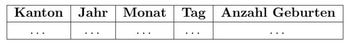
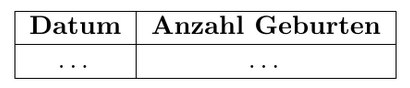

```{r setup, include=FALSE}
knitr::opts_chunk$set(echo = TRUE)
library(tidyverse)
```

# Aufgabe 1

## a)  (23 Punkte) 

Lesen Sie die Datei in ein Data Frame und bringen Sie die Daten in das Format

<br>
<div>

</div>

Stellen Sie sicher, dass Sie alle Verunreinigungen entfernt haben und dass keine fehlenden Werte vorkommen. Setzen Sie den Datentyp `float` für alle Spalten ausser `Kanton` (Pandas hat Probleme mit fehlenden Werten für den Datentyp `int`).

**Hinweis:** Setzen Sie geeignete Parameter `skiprows`, `nrows` und `usecols` (Pandas) bzw. `skip`, `n_max` und `range` (readxl / tidyverse) zum Einlesen der Excel-Datei.

```{r}
# IHR CODE
```

## b) (6 Punkte)

Leiten Sie nun aus den Spalten *Jahr*, *Monat* und *Tag* einen Datumstring ab und bringen Sie diesen in ein geeignetes Datumsformat. Beschränken Sie das Data Frame ausserdem auf Daten nur aus der ganzen Schweiz (Kanton='Switzerland'). Am Schluss sollte ihr Data Frame im folgenden Format vorliegen:

<br>

<div>

</div>

<br>

**Hinweis:** Hier können je nach Vorgehen in Teil a) invalide Datumsfelder entstehen. Die Funktion `pd.to_datetime()` hat die Option `errors="coerce"` um die Fehler einfach zu ignorieren und stattdessen `NaN`s zu setzen (die Sie natürlich entfernen müssen). Die Funktion `as_date()` aus Tidyverse geht standardmässig so vor.

```{r}
# IHR CODE
```

## c) (2 Punkte)

Visualisieren Sie exemplarisch die Anzahl der Geburten pro Tag in der Schweiz (Kanton='Switzerland') im Jahr 2019. Stellen Sie dabei sicher, dass die $x$-Achse korrekt als Datum dargestellt wird.

```{r}
# IHR CODE
```

## d) (7 Punkte)

In der Datei `'mondphasen.csv'` finden Sie für jedes Datum seit 1970 die zugehörige Mondphase, benannt nach dem folgenden Schema:

<br>

<div>

</div>

<br>

Berechnen Sie nun die durchschnittliche Anzahl der Geburten in der Schweiz pro Mondphase seit 1970. Sehen Sie einen signifikanten Unterschied? (ohne auf statistische Tests zurückzugreifen) Natürlich müssten wir hier eine vertiefte Analyse durchführen, um sauber argumentieren zu können, aber einen ersten Eindruck können wir damit gut gewinnen.

```{r}
# IHR CODE
```

## e) (4 Punkte)

Visualisieren Sie nun die durchschnittliche Anzahl der Geburten pro Wochentag über die Jahre hinweg. Finden Sie ein Muster?

```{r}
# IHR CODE
```


# Aufgabe 2

## a) (1 Punkt)

Lesen Sie die Datei in ein Data Frame ein.

```{r}
# IHR CODE
```

## b) (3 Punkte)

Verschaffen Sie sich einen ersten Überblick über die Daten. Geben Sie dazu die verschiedenen (einzigartigen) Ausprägungen aller Merkmale ausser dem Datum aus.

```{r}
# IHR CODE
```

## c) (4 Punkte)

Setzen Sie für jede Spalte einen sinnvollen Datentyp entsprechend den Ausprägungen. Stellen Sie dabei sicher, dass fehlende Werte auch sauber als solche gekennzeichnet sind. 

**Hinweis:** Der Integer-Datentyp von Pandas kann nicht mit fehlenden Werten umgehen, hier dürfen Sie stattdessen Float verwenden.

```{r}
# IHR CODE
```

## d) (2 Punkte)

Wieviele Werte fehlen pro Spalte? Geben Sie Ihre Resultate absolut und in Prozent aus. 

```{r}
# IHR CODE
```

## e) (3 Punkte)

Das Feld `'corona_result'` ist für statistische Analysen einfacher zu verwenden, wenn Sie 'negative' mit einer 0, 'positive' mit einer 1 und 'other' mit einem fehlenden Wert repräsentieren. Passen Sie Ihr Data Frame entsprechend an und verfahren Sie im gleichen Stil mit `'age_60_and_above'`.

```{r}
# IHR CODE
```

## f) (3 Punkte)

Untersuchen Sie die Variable `'test_indication'`. Welche der drei möglichen Test-Indikationen korrespondiert prozentual mit am meisten positiven Testergebnissen?

```{r}
# IHR CODE
```

## g) (3 Punkte)

Im folgenden möchten wir nur die Symptome 'cough', 'fever', 'sore_throat', 'shortness_of_breath' und 'head_ache' untersuchen. Berechnen Sie das durchschnittliche Auftreten in Prozent dieser Symptome für getestete Personen mit und ohne Covid19. Überlegen Sie sich eine Reihenfolge, wie Sie die einzelnen Symptome priorisieren würden.

```{r}
# IHR CODE
```

## h) (4 Punkte)

Sie möchten gerne ein ML-Modell trainieren, das versucht, aus den gegebenen Input-Features das Testresultat vorherzusagen. Ein sehr grosser Teil der Spalte `'age_60_and_above'` fehlt jedoch, darum möchte man eher auf das Entfernen der Spalten mit den fehlenden Werten verzichten. Nennen Sie zwei konkrete Strategien, wie man mit fehlenden Werten umgehen könnte. Was sind ihre Vor- und Nachteile?

```{r}
# IHR CODE
```

